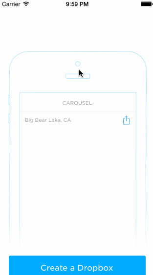
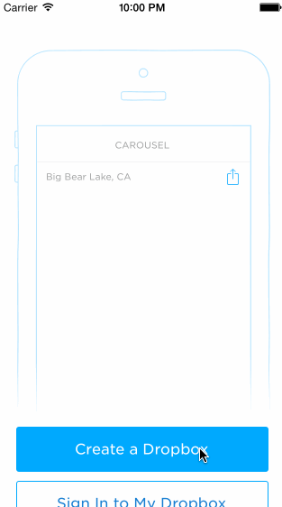

Carousel
========
Project Requirements

Sign In
[x] Tapping on email/password reveals the keyboard and shifts the scrollview and Sign In button up.
[x] User sees an error alert when no email is present or no password is present.
[x] User sees a loading screen upon tapping the Sign In button.
[x] User sees an error alert when entering the wrong email/password combination.
[x] User is taken to the tutorial screens upon entering the correct email/password combination.
[x] Optional: When the keyboard is visible, if the user pulls down on the scrollview, it will dismiss the keyboard.

[x] Optional: User is taken to the tutorial screens upon tapping the "Create a Dropbox" button.

Tutorial Screens
[x] User can page between the screens
[x] Optional: User can page between the screens with updated dots (One direction only)
[x] Optional: Upon reaching the 4th page, hide the dots and show the "Take Carousel for a Spin" button.

Image Timeline
[x]Display a scrollable view of images.
[x]User can tap on the conversations button to see the conversations screen (push).
[x]User can tap on the profile image to see the settings view (modal from below).

Settings
[Did not complete] User can dismiss the settings screen.
[Did not complete]User can log out

[Did not complete]View a photo full screen
[Did not complete]Swipe left and right
[Did not complete]Share a photo
[Did not complete]Optional: Upon completion of the events, mark them green.
[Did not complete]Optional: When all events are completed, dismiss the banner.

